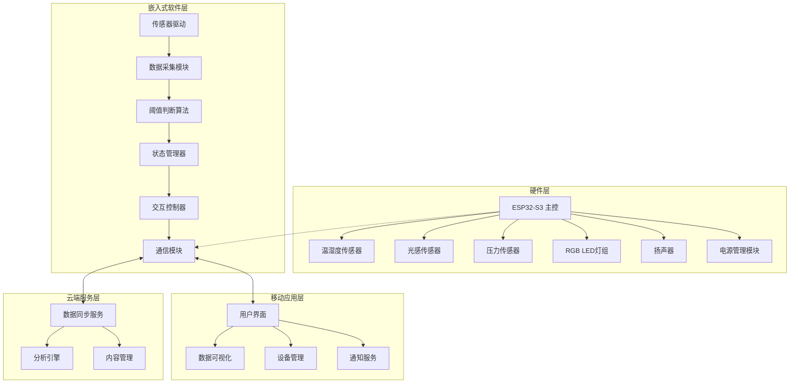

# 设计文档

## 概述

AI智能植物养护机器人是一个集成硬件传感器、嵌入式处理和移动应用的完整IoT系统。系统采用端云协同架构，以ESP32-S3为核心的嵌入式设备负责实时环境监测和本地决策，移动应用提供用户界面和数据可视化，云端服务处理复杂分析和数据同步。

设计重点关注萌系用户体验、低功耗运行和简化的交互流程，通过可爱的外观设计和直观的状态反馈来增强用户的情感连接。

## 架构

### 系统架构图



### 数据流架构

系统采用三层数据处理架构：

1. **端侧处理（80%）**: 实时传感器数据采集、阈值判断、状态反馈
2. **移动端处理**: 用户交互、本地数据缓存、推送通知
3. **云端处理（20%）**: 长期数据分析、内容更新、多设备同步

## 组件和接口

### 硬件组件

#### 主控单元
- **型号**: ESP32-S3
- **功能**: 系统控制、数据处理、无线通信
- **接口**: I2C（传感器）、GPIO（LED/扬声器）、ADC（压力传感器）
- **通信**: Wi-Fi 802.11 b/g/n、蓝牙5.0

#### 传感器模块
```typescript
interface SensorData {
  soilHumidity: number;      // 土壤湿度 (%)
  airHumidity: number;       // 空气湿度 (%)
  temperature: number;       // 温度 (°C)
  lightIntensity: number;    // 光照强度 (lux)
  timestamp: number;         // 时间戳
}
```

#### 交互硬件
```typescript
interface InteractionHardware {
  ledController: {
    setColor(r: number, g: number, b: number): void;
    setBrightness(level: number): void;
    playAnimation(type: AnimationType): void;
  };
  
  speaker: {
    playSound(soundId: SoundType): void;
    setVolume(level: number): void;
  };
  
  touchSensor: {
    onTouch(callback: () => void): void;
    isPressed(): boolean;
  };
}
```

### 软件组件

#### 嵌入式固件架构

```typescript
class PlantCareRobot {
  private sensorManager: SensorManager;
  private stateManager: StateManager;
  private interactionController: InteractionController;
  private communicationModule: CommunicationModule;
  
  async initialize(): Promise<void> {
    await this.sensorManager.calibrate();
    await this.communicationModule.connectWiFi();
    this.startMainLoop();
  }
  
  private async mainLoop(): Promise<void> {
    while (true) {
      const sensorData = await this.sensorManager.readAll();
      const plantState = this.stateManager.evaluateState(sensorData);
      await this.interactionController.updateDisplay(plantState);
      
      if (plantState.needsAttention) {
        await this.interactionController.triggerAlert();
      }
      
      await this.sleep(5000); // 5秒采集间隔
    }
  }
}
```

#### 状态管理系统

```typescript
enum PlantState {
  HEALTHY = 'healthy',
  NEEDS_WATER = 'needs_water',
  NEEDS_LIGHT = 'needs_light',
  CRITICAL = 'critical'
}

interface PlantStatus {
  state: PlantState;
  soilMoisture: number;
  lightLevel: number;
  temperature: number;
  lastWatered?: Date;
  needsAttention: boolean;
}

class StateManager {
  private readonly MOISTURE_THRESHOLD = 30; // 30%
  private readonly LIGHT_THRESHOLD = 500;   // 500 lux
  
  evaluateState(sensorData: SensorData): PlantStatus {
    let state = PlantState.HEALTHY;
    let needsAttention = false;
    
    if (sensorData.soilHumidity < this.MOISTURE_THRESHOLD) {
      state = PlantState.NEEDS_WATER;
      needsAttention = true;
    }
    
    if (sensorData.lightIntensity < this.LIGHT_THRESHOLD) {
      state = PlantState.NEEDS_LIGHT;
      needsAttention = true;
    }
    
    return {
      state,
      soilMoisture: sensorData.soilHumidity,
      lightLevel: sensorData.lightIntensity,
      temperature: sensorData.temperature,
      needsAttention
    };
  }
}
```

#### 移动应用架构

```typescript
interface MobileApp {
  deviceManager: DeviceManager;
  dataVisualizer: DataVisualizer;
  notificationService: NotificationService;
  userInterface: UserInterface;
}

class DeviceManager {
  async connectDevice(deviceId: string): Promise<boolean>;
  async syncData(): Promise<SensorData[]>;
  async sendCommand(command: DeviceCommand): Promise<void>;
}

class DataVisualizer {
  generateTrendChart(data: SensorData[], days: number): ChartData;
  createHealthReport(plantStatus: PlantStatus): HealthReport;
}
```

## 数据模型

### 核心数据结构

```typescript
// 设备配置
interface DeviceConfig {
  deviceId: string;
  plantType: string;
  moistureThreshold: number;
  lightThreshold: number;
  alertInterval: number; // 分钟
  soundEnabled: boolean;
}

// 历史记录
interface CareRecord {
  id: string;
  deviceId: string;
  action: 'watered' | 'moved_to_light' | 'fertilized';
  timestamp: Date;
  sensorDataBefore: SensorData;
  sensorDataAfter?: SensorData;
}

// 用户设置
interface UserPreferences {
  userId: string;
  notificationsEnabled: boolean;
  quietHours: {
    start: string; // "22:00"
    end: string;   // "08:00"
  };
  plantNicknames: Map<string, string>;
}
```

### 数据持久化

```typescript
class DataStorage {
  // 本地存储（嵌入式设备）
  async saveCurrentState(state: PlantStatus): Promise<void>;
  async loadLastKnownState(): Promise<PlantStatus | null>;
  
  // 移动端存储
  async cacheSensorData(data: SensorData[]): Promise<void>;
  async getCachedData(days: number): Promise<SensorData[]>;
  
  // 云端同步
  async syncToCloud(data: any): Promise<void>;
  async fetchFromCloud(deviceId: string): Promise<any>;
}
```

现在我需要进行验收标准的预分析，然后编写正确性属性。

<function_calls>
<invoke name="prework">
<parameter name="featureName">ai-plant-care-robot

## 正确性属性

*属性是一个特征或行为，应该在系统的所有有效执行中保持为真——本质上是关于系统应该做什么的正式声明。属性作为人类可读规范和机器可验证正确性保证之间的桥梁。*

基于需求分析，以下是系统必须满足的关键正确性属性：

### 属性反思

在编写具体属性之前，我需要识别和消除冗余：

- 属性2和属性3可以合并为一个综合的状态显示属性
- 属性4和属性5都涉及触摸响应，可以合并
- 属性7和属性8都涉及提醒行为，可以合并
- 多个涉及状态变化的属性可以统一为状态一致性属性

### 核心属性

**属性 1: 环境阈值检测**
*对于任何* 传感器读数，当土壤湿度低于30%时，系统应检测到缺水状态；当光照强度低于500lux时，系统应检测到光照不足状态
**验证需求: 需求 1.1, 1.2**

**属性 2: 状态指示一致性**
*对于任何* 植物状态，LED指示器应显示对应的颜色：正常状态显示绿色，缺水状态显示黄色，光照不足显示红色
**验证需求: 需求 2.1, 2.2, 2.3**

**属性 3: 触摸交互响应**
*对于任何* 触摸事件，系统应同时播放音效和显示动画效果
**验证需求: 需求 2.4, 2.5**

**属性 4: 异常状态记录**
*对于任何* 超出正常范围的环境参数，系统应记录异常状态和对应的时间戳
**验证需求: 需求 1.4**

**属性 5: 主动提醒触发**
*对于任何* 异常状态，当持续时间超过30分钟时，系统应启动主动提醒（LED闪烁和音效播放）
**验证需求: 需求 3.1, 3.3**

**属性 6: 提醒确认停止**
*对于任何* 正在进行的主动提醒，当用户触摸确认后，系统应立即停止提醒
**验证需求: 需求 3.4**

**属性 7: 重复提醒机制**
*对于任何* 未解决的异常状态，系统应每2小时重复提醒一次
**验证需求: 需求 3.5**

**属性 8: 低电量警告**
*对于任何* 电池电量读数，当电量低于20%时，状态指示器应显示低电量警告
**验证需求: 需求 4.3**

**属性 9: 电源模式切换**
*对于任何* 外部电源连接事件，系统应自动切换到外部供电模式
**验证需求: 需求 4.5**

**属性 10: 数据同步一致性**
*对于任何* Wi-Fi连接状态，当网络可用时，系统应能够与移动应用同步数据
**验证需求: 需求 5.1**

**属性 11: 用户行为记录**
*对于任何* 用户照料行为，移动应用应记录该行为和对应的植物状态变化
**验证需求: 需求 5.3**

**属性 12: 异常通知推送**
*对于任何* 异常状态通知，移动应用应发送推送通知给用户
**验证需求: 需求 5.4**

**属性 13: 多设备管理**
*对于任何* 设备集合，移动应用应支持同时管理多个机器人设备
**验证需求: 需求 5.5**

**属性 14: 开机状态显示**
*对于任何* 开机事件，状态指示器应立即显示当前植物状态
**验证需求: 需求 7.2**

**属性 15: 确认反馈动作**
*对于任何* 用户确认操作，系统应执行相应的反馈动作
**验证需求: 需求 7.3**

**属性 16: 问题解决反馈**
*对于任何* 问题解决事件，状态指示器应变为绿色并播放开心音效
**验证需求: 需求 7.4**

**属性 17: 云端数据处理**
*对于任何* 复杂数据分析需求，系统应将数据发送到云端处理
**验证需求: 需求 8.2**

**属性 18: 离线基础功能**
*对于任何* 网络断开情况，系统应继续提供基础的环境监测和状态反馈功能
**验证需求: 需求 8.3**

## 错误处理

### 传感器故障处理

```typescript
class SensorErrorHandler {
  handleSensorFailure(sensorType: SensorType, error: Error): void {
    // 记录错误日志
    this.logger.error(`Sensor ${sensorType} failed: ${error.message}`);
    
    // 使用备用策略
    switch (sensorType) {
      case SensorType.SOIL_HUMIDITY:
        this.useLastKnownValue(sensorType);
        this.showSensorErrorIndicator();
        break;
      case SensorType.LIGHT:
        this.estimateFromTimeOfDay();
        break;
      default:
        this.enterSafeMode();
    }
  }
  
  private enterSafeMode(): void {
    // 显示错误状态
    this.ledController.setColor(255, 165, 0); // 橙色表示错误
    this.ledController.setBrightness(50);
    
    // 播放错误提示音
    this.speaker.playSound(SoundType.ERROR);
    
    // 通知移动应用
    this.communicationModule.sendErrorNotification();
  }
}
```

### 网络连接错误

```typescript
class NetworkErrorHandler {
  private retryCount = 0;
  private readonly MAX_RETRIES = 3;
  
  async handleConnectionError(error: NetworkError): Promise<void> {
    this.retryCount++;
    
    if (this.retryCount <= this.MAX_RETRIES) {
      // 指数退避重试
      const delay = Math.pow(2, this.retryCount) * 1000;
      await this.sleep(delay);
      
      try {
        await this.communicationModule.reconnect();
        this.retryCount = 0; // 重置计数器
      } catch (retryError) {
        await this.handleConnectionError(retryError);
      }
    } else {
      // 进入离线模式
      this.enterOfflineMode();
    }
  }
  
  private enterOfflineMode(): void {
    this.isOfflineMode = true;
    this.startLocalDataBuffer();
    this.showOfflineIndicator();
  }
}
```

### 电源管理错误

```typescript
class PowerManagementErrorHandler {
  handleLowBattery(batteryLevel: number): void {
    if (batteryLevel < 5) {
      // 紧急关机保护
      this.emergencyShutdown();
    } else if (batteryLevel < 20) {
      // 进入省电模式
      this.enterPowerSaveMode();
    }
  }
  
  private enterPowerSaveMode(): void {
    // 降低采样频率
    this.sensorManager.setSamplingInterval(30000); // 30秒
    
    // 降低LED亮度
    this.ledController.setBrightness(20);
    
    // 禁用非必要功能
    this.disableNonEssentialFeatures();
    
    // 显示低电量警告
    this.showLowBatteryWarning();
  }
}
```

## 测试策略

### 双重测试方法

系统采用单元测试和基于属性的测试相结合的综合测试策略：

**单元测试**：
- 验证具体示例、边界情况和错误条件
- 测试组件间的集成点
- 验证特定的用户交互场景

**基于属性的测试**：
- 验证跨所有输入的通用属性
- 通过随机化实现全面的输入覆盖
- 每个属性测试最少运行100次迭代

### 基于属性的测试配置

使用 **Jest** 和 **fast-check** 库进行基于属性的测试：

```typescript
import fc from 'fast-check';

describe('Plant Care Robot Properties', () => {
  // 属性1: 环境阈值检测
  test('环境阈值检测属性', () => {
    fc.assert(fc.property(
      fc.record({
        soilHumidity: fc.float(0, 100),
        lightIntensity: fc.float(0, 2000)
      }),
      (sensorData) => {
        const state = stateManager.evaluateState(sensorData);
        
        if (sensorData.soilHumidity < 30) {
          expect(state.state).toBe(PlantState.NEEDS_WATER);
        }
        
        if (sensorData.lightIntensity < 500) {
          expect(state.state).toBe(PlantState.NEEDS_LIGHT);
        }
      }
    ), { numRuns: 100 });
  });
  
  // 属性2: 状态指示一致性
  test('状态指示一致性属性', () => {
    fc.assert(fc.property(
      fc.constantFrom(PlantState.HEALTHY, PlantState.NEEDS_WATER, PlantState.NEEDS_LIGHT),
      (plantState) => {
        interactionController.updateDisplay(plantState);
        const ledColor = ledController.getCurrentColor();
        
        switch (plantState) {
          case PlantState.HEALTHY:
            expect(ledColor).toEqual({ r: 0, g: 255, b: 0 }); // 绿色
            break;
          case PlantState.NEEDS_WATER:
            expect(ledColor).toEqual({ r: 255, g: 255, b: 0 }); // 黄色
            break;
          case PlantState.NEEDS_LIGHT:
            expect(ledColor).toEqual({ r: 255, g: 0, b: 0 }); // 红色
            break;
        }
      }
    ), { numRuns: 100 });
  });
});
```

### 测试标签格式

每个基于属性的测试必须使用以下标签格式进行注释：

```typescript
/**
 * Feature: ai-plant-care-robot, Property 1: 环境阈值检测
 * 对于任何传感器读数，当土壤湿度低于30%时，系统应检测到缺水状态
 */
```

### 单元测试示例

```typescript
describe('Specific Examples and Edge Cases', () => {
  test('首次开机进入配置模式', () => {
    // 需求 7.1 的具体示例
    const robot = new PlantCareRobot();
    robot.firstBoot();
    
    expect(robot.getCurrentMode()).toBe(Mode.CONFIGURATION);
  });
  
  test('5分钟数据采集间隔', () => {
    // 需求 1.5 的具体示例
    const startTime = Date.now();
    const dataPoints = [];
    
    // 模拟数据采集
    robot.startDataCollection((data) => {
      dataPoints.push({ data, timestamp: Date.now() });
    });
    
    // 等待两次采集
    setTimeout(() => {
      expect(dataPoints.length).toBe(2);
      const interval = dataPoints[1].timestamp - dataPoints[0].timestamp;
      expect(interval).toBeCloseTo(300000, 1000); // 5分钟 ± 1秒
    }, 600000);
  });
});
```

### 集成测试

```typescript
describe('Integration Tests', () => {
  test('端到端用户流程', async () => {
    // 模拟完整的用户交互流程
    const robot = new PlantCareRobot();
    await robot.initialize();
    
    // 模拟缺水状态
    robot.sensorManager.mockSensorData({
      soilHumidity: 25, // 低于30%阈值
      lightIntensity: 800
    });
    
    // 验证状态检测
    await robot.processData();
    expect(robot.getCurrentState()).toBe(PlantState.NEEDS_WATER);
    
    // 验证LED显示
    expect(robot.ledController.getCurrentColor()).toEqual({ r: 255, g: 255, b: 0 });
    
    // 模拟用户浇水
    robot.sensorManager.mockSensorData({
      soilHumidity: 60, // 正常水平
      lightIntensity: 800
    });
    
    await robot.processData();
    
    // 验证状态恢复
    expect(robot.getCurrentState()).toBe(PlantState.HEALTHY);
    expect(robot.ledController.getCurrentColor()).toEqual({ r: 0, g: 255, b: 0 });
    expect(robot.speaker.getLastPlayedSound()).toBe(SoundType.HAPPY);
  });
});
```

这个测试策略确保了系统的正确性通过具体示例和通用属性的双重验证，为AI智能植物养护机器人提供了全面的质量保证。